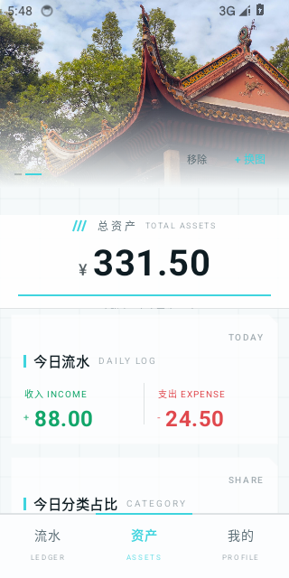
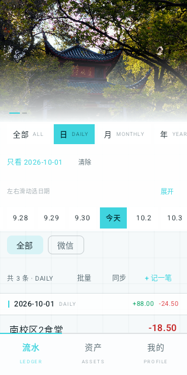
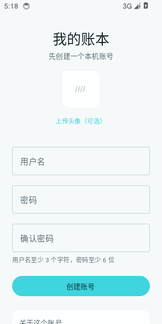
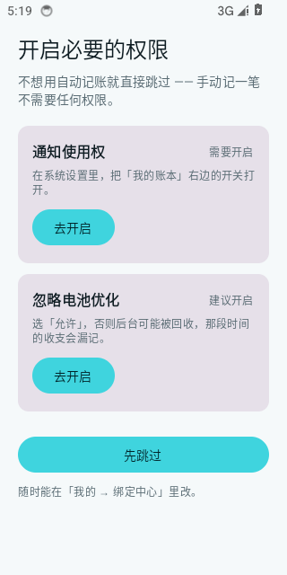
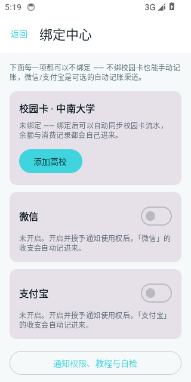
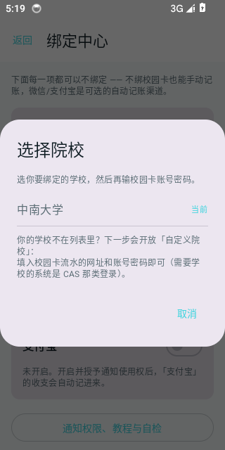

# 我的账本

一个 Android 记账 App。会自动同步校园卡流水，也会读微信和支付宝的支付通知自动记账。

数据只存在手机里，没有服务器，不上传。

Kotlin + Jetpack Compose，最低支持 Android 8.0。

## 长什么样

注册、权限、绑定中心、选择院校这几屏：

## 能做什么

记账

- 流水按日、月、年分组，日期条上左右滑动就能换日期，当前选中的那项居中
- 每笔都能改名、改分类。分类有二级，比如餐饮下面是食堂、外卖、饮品
- 待确认的记录可以补金额，不用删了重记
- 批量清理误抓的旧记录

自动记账

- 读微信和支付宝的支付通知，本地解析出金额和商户后记一笔
- 两手倒的转账会自动配对，不算进支出
- 配对不上的（银行卡充值、提现、还款）可以手动标成内部转账
- 账户能加多个，校园卡、微信、支付宝各算各的余额

校园卡

- 填上学号密码就能同步余额和消费记录，余额跟着流水自动变
- 请求做了频率限制，免得触发学校风控

账单导入

- 微信、支付宝导出的 CSV、XLSX、加密 ZIP 都能直接导进来
- 按列名找字段，不写死行列位置，账单格式变了也不容易崩
- 三层去重，不会和已经同步的流水重复

外观

- 四种底色、六种主题色
- 顶部图片可以换成自己的照片，头像也能传

## 装

去 [Releases](../../releases) 下 APK，大概 2 MB。

第一次打开会让你注册一个本机账号，可以顺便传个头像。然后讲一下要开哪些权限，最后进绑定中心。每一步都能跳过，什么都不绑也能当普通账本用。

## 自己编译

需要 JDK 17 和 Android SDK 35。

    ./gradlew assembleDebug
    ./gradlew testDebugUnitTest

正式包要签名，在项目根目录建一个 keystore.properties：

    storeFile=keystore/你的.jks
    storePassword=你的口令
    keyAlias=你的别名
    keyPassword=你的口令

这个文件不要提交，已经在 .gitignore 里了。没有它的话 release 包不会被签名，能编译但装不上，不会导致构建失败。

## 支持的学校

| 学校 | 状态 |
|---|---|
| 中南大学 | 已实测通过，登录、卡信息、流水字段都验证过 |
| 其他学校 | 还没适配 |

一所学校在代码里就是一个 SchoolProfile 配置对象，加学校基本就是填这个对象。适配前建议先看看 [docs/DEVLOG.md](docs/DEVLOG.md)，里面有接口实测结论和适配清单，也写了华南师范大学为什么接不进来（四个入口都试过了，走不通）。

## 隐私

没有服务器，数据只在这台手机上。

通知使用权只读微信和支付宝的支付通知，在本地解析，原文不联网。校园卡密码用 Android Keystore 的 AES 密钥加密后存本机，本机账号的密码是加盐哈希，原文不落盘。没有统计埋点，没有崩溃上报，没有广告 SDK。卸载或清除数据就全没了，我这边没有副本。

细节在 [PRIVACY.md](PRIVACY.md)。

## 已知的问题

数据库没加密。本机密码锁只挡界面，能 root 手机又能碰到手机的人可以读到数据。这是故意的，原因写在隐私政策里。

小米和红米用户要开自启动，不然系统不让绑定通知监听服务。App 里做了自检，遇到这种情况会提示你去哪开。

校园卡的消费不会出现在微信支付宝账单里，那是卡内扣费，所以账单导入抓不到这部分。

学校系统改了接口就会失效。

记账结果仅供参考，别拿去报销。

## 文档

[docs/DEVLOG.md](docs/DEVLOG.md) 是开发过程记录，接口实测、字段含义、踩过的坑都在里面。

[用户协议](TERMS.md) / [隐私政策](PRIVACY.md) / [许可](LICENSE)。

## 谢

微信和支付宝账单的表头有多少行，这个结论来自 [double-entry-generator](https://github.com/deb-sig/double-entry-generator)，MIT 协议。我没抄它的代码，改成了先找表头行再按列名映射，这样列顺序变了也不会崩。

单元测试配置里有一处绕法出自 [Robolectric issue #7055](https://github.com/robolectric/robolectric/issues/7055)。

用到的库：AndroidX、Compose、Material 3、[zip4j](https://github.com/srikanth-lingala/zip4j)，都是 Apache-2.0。测试用的 Robolectric 是 MIT，JUnit 4 是 EPL-1.0。

## 许可

非商业使用，见 [LICENSE](LICENSE)。自己用、改、分享都行，别拿去卖。

这个 App 是我个人写的，不是官方应用，和中南大学以及其他任何学校、和微信支付宝都没有关系。